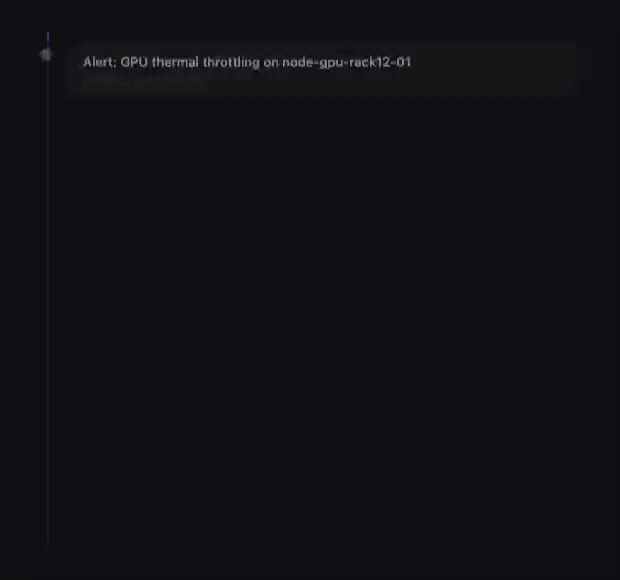

# Ops Triage Agent

An autonomous AI agent that monitors data center alerts, triages incidents, and escalates critical issues — replacing manual on-call  with a tool-use loop that reasons, correlates, and acts in real time.

The agent receives an alert, gathers context, decides, and acts. Each step streams to the dashboard live.



## Quick start

```bash
cp .env.example .env
# Set LLM_PROVIDER, LLM_MODEL, and LLM_API_KEY in .env
docker compose up --build
# Open http://localhost:3000
```

Or without Docker:

```bash
python -m venv .venv && source .venv/bin/activate
pip install -r requirements.txt
cp .env.example .env
# Edit .env
uvicorn backend.main:app --port 8000
```

### LLM providers

Set `LLM_PROVIDER` in `.env`:

```bash
# Anthropic
LLM_PROVIDER=anthropic
LLM_MODEL=claude-sonnet-4-6-latest
LLM_API_KEY=sk-ant-...

# OpenAI
LLM_PROVIDER=openai
LLM_MODEL=gpt-4.1-mini
LLM_API_KEY=sk-...

```

## Architecture


The agent has 5 tools: `query_recent_alerts` (find correlated events), `get_host_info` (hardware context), `search_runbooks` (RAG over 14 runbooks), `create_incident` (open a tracked record), and `escalate` (notify on-call via webhook). It classifies each alert as **noise**, **acknowledged**, **incident**, or **critical_escalation**.

## Simulated failure scenarios

The alert simulator generates 5 realistic multi-step failure patterns:

- **Thermal cascade** — CRAC failure triggers GPU throttling and training degradation
- **GPU hardware failure** — ECC errors escalate to NVLink failures and node drain
- **Network partition** — Switch flapping causes packet loss and training stalls
- **Storage degradation** — SMART warnings lead to checkpoint write failures
- **Power anomaly** — Voltage fluctuation triggers UPS engagement and load shedding

The agent must determine which alerts are correlated across these scenarios.

## Configuration

See [`.env.example`](.env.example) for all options. Key settings:

| Variable | Default | Description |
|----------|---------|-------------|
| `LLM_PROVIDER` | `anthropic` | `anthropic` or `openai` |
| `LLM_MODEL` | `claude-sonnet-4-6-latest` | Model name |
| `ALERT_INTERVAL_MIN` | `60` | Min seconds between alerts |
| `WEBHOOK_URL` | — | Outgoing webhook for escalations (HMAC-signed) |

## Testing

```bash
pip install -r requirements-dev.txt
python -m pytest tests/ -v
```

99 tests covering the parser, Pydantic models, scenario structure, RAG chunking, LLM client, error paths, SSE broadcaster, and config validation.

## Design principles

- **Model-agnostic** — swap LLM providers (or plug in your own inference endpoint) without touching agent logic
- **Observable** — every reasoning step is streamed to the dashboard; audit logs capture all tool calls and decisions
- **Evaluation-aware** — see [EVALUATION.md](EVALUATION.md) for the triage accuracy assessment framework
