# Ops Triage Agent

An autonomous agent that monitors data center alerts, triages incidents, and escalates critical issues — with full reasoning traces streamed to a live dashboard.



## Quick start

```bash
cp .env.example .env
# Set LLM_PROVIDER, LLM_MODEL, and LLM_API_KEY in .env
docker compose up --build
# Open http://localhost:3000
```

Or without Docker:

```bash
python -m venv .venv && source .venv/bin/activate
pip install -r requirements.txt
cp .env.example .env
# Edit .env
uvicorn backend.main:app --port 8000
```

### LLM providers

Set `LLM_PROVIDER` in `.env`:

```bash
# Anthropic
LLM_PROVIDER=anthropic
LLM_MODEL=claude-sonnet-4-20250514
LLM_API_KEY=sk-ant-...

# OpenAI
LLM_PROVIDER=openai
LLM_MODEL=gpt-4o-mini
LLM_API_KEY=sk-...

# Local (Ollama)
LLM_PROVIDER=openai
LLM_MODEL=llama3.2
LLM_API_BASE=http://localhost:11434/v1
LLM_API_KEY=
```

## How the agent works



The triage agent runs a tool-use loop: it receives an alert, gathers context by calling tools (query correlated alerts, look up host info, search runbooks), then decides on a classification and next steps. Each step is streamed to the dashboard in real time via SSE.

**Tools available to the agent:**

| Tool | Purpose |
|------|---------|
| `query_recent_alerts` | Find correlated alerts by rack, host, category |
| `get_host_info` | Hardware specs, status, incident history |
| `search_runbooks` | RAG search over 14 operational runbooks |
| `create_incident` | Create a tracked incident record |
| `escalate` | Escalate to on-call with webhook notification |

**Classifications:** noise, acknowledged, incident, critical_escalation

## Simulated failure scenarios

The alert simulator generates 5 realistic multi-step failure patterns:

- **Thermal cascade** — CRAC failure triggers GPU throttling and training degradation
- **GPU hardware failure** — ECC errors escalate to NVLink failures and node drain
- **Network partition** — Switch flapping causes packet loss and training stalls
- **Storage degradation** — SMART warnings lead to checkpoint write failures
- **Power anomaly** — Voltage fluctuation triggers UPS engagement and load shedding

The agent must determine which alerts are correlated across these scenarios.

## Configuration

See [`.env.example`](.env.example) for all options. Key settings:

| Variable | Default | Description |
|----------|---------|-------------|
| `LLM_PROVIDER` | `openai` | `openai` or `anthropic` |
| `LLM_MODEL` | `gpt-4o-mini` | Model name |
| `ALERT_INTERVAL_MIN` | `90` | Min seconds between alerts |
| `WEBHOOK_URL` | — | Outgoing webhook for escalations (HMAC-signed) |

## Testing

```bash
python -m pytest tests/ -v
```

68 tests covering the parser, Pydantic models, scenario structure, RAG chunking, and LLM client (including Anthropic format conversion).

## Development process

This project was scaffolded with AI assistance and then hardened through manual engineering review — 10 bug fixes, 68 unit tests, evaluation framework, and webhook integration. See [EVALUATION.md](EVALUATION.md) for the triage accuracy assessment framework.
